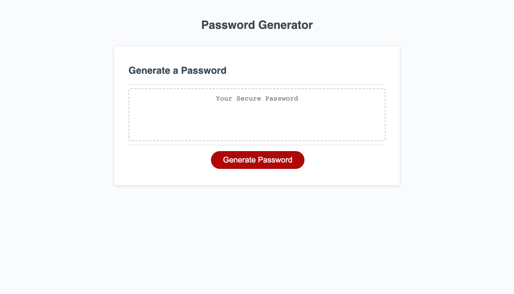

# password-generator

# Purpose
The purpose of a password generator is to create a random, strong and secure passwords to prevent unauthorized individuals to gain access into sensitive data.

# Usage
1. Navigate to the password generator website.
2. Click "Generate Password" and the website will generate a secured and random passwords based on your preferences.

# Website
https://jdrei01.github.io/password-generator/

# Screenshot

# Credits
Created by Jandrei Timoteo with the help of Instructor Diarmuid Murphy and Tutor Sheetal Bangalore Srikumar.
Starter code is retrieved from https://github.com/coding-boot-camp/friendly-parakeet